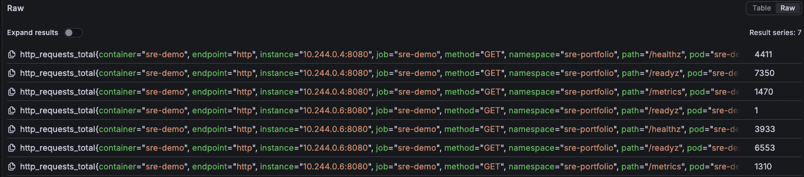
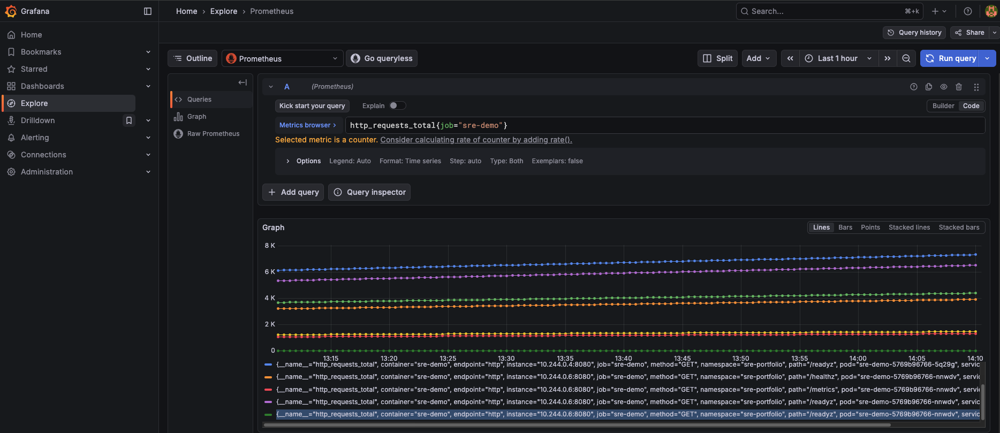

# Cloud SRE Portfolio FastAPI + Kubernetes + Prometheus + Grafana

Production-style **Site Reliability Engineering (SRE)** demo showcasing:

- Containerized FastAPI microservice
- Kubernetes deployment
- Prometheus metrics instrumentation
- Grafana Golden Signals dashboard
- Automated scraping via ServiceMonitor
- Load testing with real traffic patterns

This project demonstrates **core SRE principles**:

- Observability
- Reliability metrics
- Traffic analysis
- Error monitoring
- Latency tracking
- Production-style dashboards

---

# Architecture Overview

## Monitoring Flow

1. FastAPI service exposes metrics at `/metrics`
2. Prometheus scrapes metrics using a Kubernetes **ServiceMonitor**
3. Metrics are stored in Prometheus time-series database
4. Grafana queries Prometheus
5. Golden Metric Data dashboards visualize service health
6. (Optional) Alertmanager triggers alerts from SLO rules

---

# Observability Stack

This project uses the **kube-prometheus-stack** Helm chart, which includes:

- Prometheus (metrics collection)
- Grafana (visualization)
- Alertmanager (alert routing)
- Node exporter (host metrics)
- Kubernetes metrics

---

# SRE Golden Metric Dashboard

The Grafana dashboard visualizes the **four Golden Metrics** used in SRE:

- Traffic
- Errors
- Latency
- Saturation (approximated via latency and error behavior)

## Dashboard: SRE Demo – FastAPI


---

# Dashboard Metrics Explained

The dashboard contains **six production-style SRE metrics**.

---

## 1) RPS (Requests/sec) — Traffic

**What it is:**  
Number of HTTP requests the service receives per second.

**Why it matters:**

- Confirms the service is receiving traffic
- Helps correlate traffic spikes with latency or errors
- Used for capacity planning and autoscaling

**What to watch for:**

- Sudden spikes → potential saturation
- Drop to zero → service outage or routing issue

---

## 2) Success Rate (%) — Reliability

**What it is:**  
Percentage of requests that are not 5xx errors.

**Why it matters:**

- High-level reliability indicator
- Reflects real user experience
- Used for SLO tracking (e.g., 99.9%)

**What to watch for:**

- Any sustained drop below 100%
- Indicates customer-visible failures

**SRE framing:**

> Success rate represents customer-impact reliability and SLO compliance.

---

## 3) 5xx Error Rate — Failures

**What it is:**  
Number of server-side errors per second (HTTP 500–599).

**Why it matters:**

- Indicates application-side failures
- Key signal for incidents
- Drives error budget consumption

**What to watch for:**

- Spikes during traffic increases
- Sustained non-zero error rate

**SRE framing:**

> Monitored 5xx error rate to detect error budget burn and reliability regressions.

---

## 4) Latency (Average) — Typical Performance

**What it is:**  
Average request duration.

**Why it matters:**

- Shows overall performance trends
- Useful for detecting broad performance shifts

**Important SRE principle:**

> Averages can hide slow requests.

**What to watch for:**

- Sudden increase after traffic spike
- Gradual increase indicating resource saturation

---

## 5) Latency p95 — Real User Experience

**What it is:**  
95% of requests complete faster than this value.

**Why it matters:**

- Represents typical user experience
- Captures tail latency better than averages
- Common SLO latency metric

**What to watch for:**

- Rising p95 → users experiencing slow responses

**SRE framing:**

> Used p95 latency to monitor user-perceived performance.

---

## 6) Latency p99 — Tail Latency

**What it is:**  
99% of requests complete faster than this value.

**Why it matters:**

- Shows worst-case performance
- Early indicator of saturation
- Can trigger retries and cascading failures

**What to watch for:**

- p99 rising while average stays flat
- Sustained spikes indicate instability

**SRE framing:**

> Monitored p99 latency to detect long-tail performance issues before incidents.

---

# Additional Observability Screenshots

## Prometheus Target Health


Shows the FastAPI service being scraped successfully.

---

## Raw Metrics Query


Direct Prometheus metrics from the service.

---

## Metrics Time-Series Graph


Visualized HTTP request metrics over time.

---

# How to Reproduce Locally

## Prerequisites

- Docker
- Kubernetes (minikube, kind, or Docker Desktop)
- kubectl
- Helm
- hey (load testing tool)

Install hey in terminal for (macOS):

```bash
brew install hey
```
Step 1 - Start Kubernetes

```bash
minikube start
```

Verify: nodes are running
```bash
kubectl get nodes
```

Step 2 — Deploy Monitoring Stack (Prometheus + Grafana)

```bash
helm repo add prometheus-community https://prometheus-community.github.io/helm-charts
helm repo update

helm upgrade --install monitoring prometheus-community/kube-prometheus-stack \
  -n monitoring --create-namespace \
  -f observability/helm/values-monitoring.yaml
```
Verify pods are up
```bash
kubectl get pods -n monitoring
```
Step 3 — Deploy data to Service
> This assumes your Kubernetes manifests live under k8s/ (Deployment/Service/ServiceMonitor/etc).

```bash
kubectl apply -f k8s/
```
Verify Pods:
```bash
kubectl get pods -n sre-portfolio